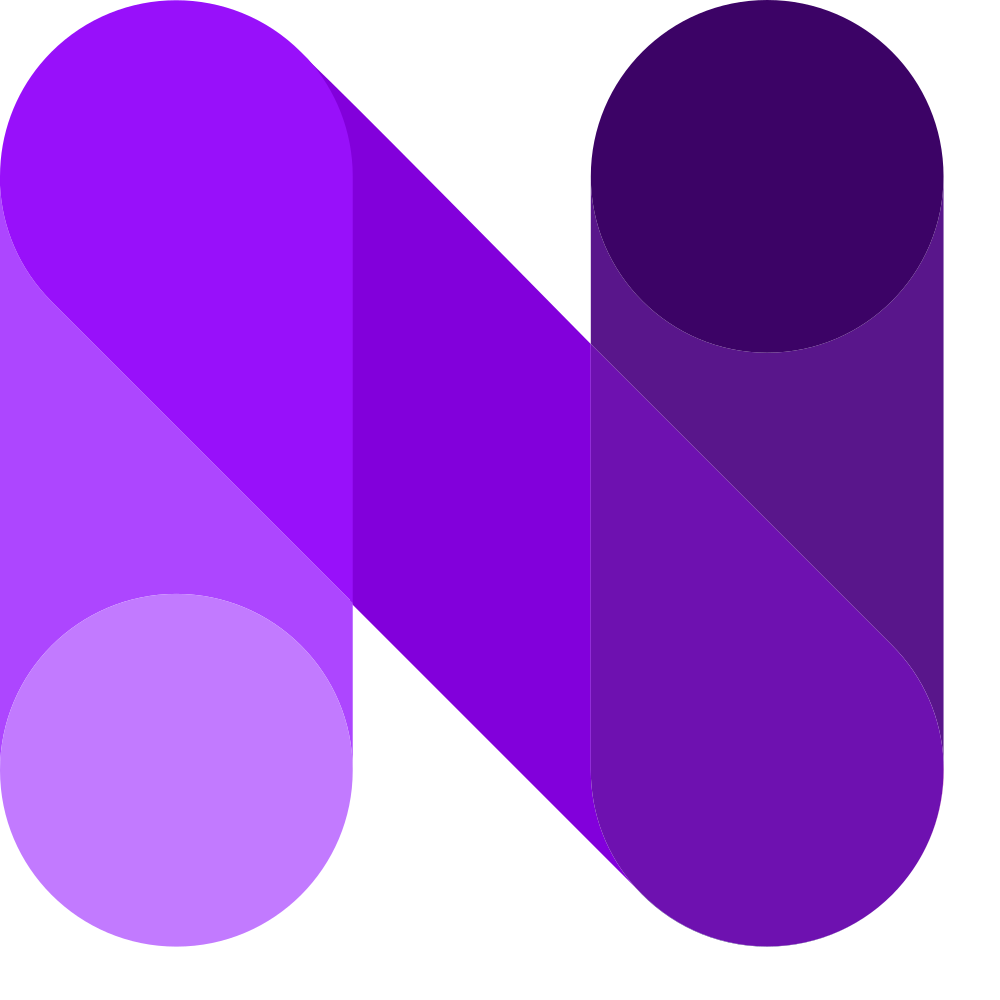

<div align="center">

# 🚀 Fronnexus — Digital Agency



### ✨ Agencia digital global especializada em experiencias web de alta performance

[](https://nextjs.org/)
[](https://react.dev/)
[](https://tailwindcss.com/)
[](https://supabase.com/)
[](https://threejs.org/)
[](https://gsap.com/)

---

**[🌐 Acesse o Site](https://fronnexus.com)** · **[📬 Entre em Contato](https://fronnexus.com/contact)** · **[📘 Documentacao Completa](doc.md)**

</div>

---

## 📋 Sobre o Projeto

O **Fronnexus** e o site institucional de uma agencia digital que conecta design, tecnologia e estrategia para criar experiencias digitais que geram resultados reais.

O site apresenta a empresa, seus servicos, portfolio de projetos e um formulario de contato profissional — tudo construido com tecnologias modernas, animacoes WebGL imersivas e um design glassmorphism elegante.

---

## 📸 Screenshots

<div align="center">

> 🖼️ *Adicione capturas de tela do projeto aqui*
>
> **Sugestao:** Tire screenshots das paginas Home, About, Projects e Contact e adicione nesta secao.

| Pagina | Descricao |
|--------|-----------|
| 🏠 **Home** | Hero animado + servicos + portfolio + CTAs |
| 👥 **About** | Apresentacao da agencia + skills marquee |
| 💼 **Projects** | Portfolio completo com cards interativos |
| 📧 **Contact** | Formulario profissional com validacao |

</div>

---

## ⚡ Funcionalidades

- 🎨 **Design Glassmorphism** — Interface moderna com blur, transparencia e efeitos de vidro
- 🌙 **Tema Claro/Escuro** — Troca automatica via `prefers-color-scheme`
- 🎬 **Animacoes WebGL** — Efeitos visuais imersivos (LightRays, Plasma, PixelBlast) com shaders GLSL
- 🃏 **CardSwap GSAP** — Animacao de troca de cards com perspectiva 3D
- 📜 **Scroll Reveal** — Animacoes de entrada com IntersectionObserver
- 📱 **100% Responsivo** — Funciona perfeitamente em mobile, tablet e desktop
- 📊 **Portfolio Dinamico** — Projetos carregados em tempo real do Supabase
- 📬 **Formulario Inteligente** — Validacao client + server, envio via Resend ou fallback Supabase
- ♿ **Acessivel** — `aria-labels`, `focus-visible`, `prefers-reduced-motion`
- ⚡ **Performance** — Turbopack, lazy loading, dynamic imports, IntersectionObserver
- 🔐 **Termos e Privacidade** — Pagina dedicada com conformidade LGPD/GDPR

---

## 🛠 Tecnologias Utilizadas

<div align="center">

| Categoria | Tecnologias |
|-----------|-------------|
| ⚛️ **Framework** | Next.js 16, React 19, App Router |
| 🎨 **Estilizacao** | Tailwind CSS 4, PostCSS, CSS Variables |
| 🎬 **Animacoes** | GSAP, Three.js, OGL, postprocessing |
| 🗄️ **Backend** | Supabase, Resend API, Next.js API Routes |
| 📝 **Formularios** | React Hook Form, Zod, validacao customizada |
| 🔧 **Icones** | React Icons (Feather), Lucide React |
| 📦 **Dev Tools** | ESLint 9, Turbopack |

</div>

---

## 🚀 Como Usar

### 📋 Pre-requisitos

- [Node.js](https://nodejs.org/) 18+ (recomendado 20+)
- npm, yarn ou pnpm

### 📥 Clonando o Repositorio

```bash
git clone https://github.com/dev-erickydias/fronnexus.git
cd fronnexus
```

### 📦 Instalando Dependencias

```bash
npm install
```

### 🔐 Configurando Variaveis de Ambiente

Crie um arquivo `.env.local` na raiz do projeto:

```env
# Supabase (obrigatorio para carregar projetos)
NEXT_PUBLIC_SUPABASE_URL=https://seu-projeto.supabase.co
NEXT_PUBLIC_SUPABASE_ANON_KEY=sua-chave-anon-aqui

# Resend (opcional — para envio de emails do formulario)
RESEND_API_KEY=re_sua_chave_aqui
```

### 🖥️ Rodando em Desenvolvimento

```bash
npm run dev
```

Acesse **[http://localhost:3000](http://localhost:3000)** no navegador.

### 🏗️ Build de Producao

```bash
npm run build
npm run start
```

### 🔍 Linting

```bash
npm run lint
```

---

## 📁 Estrutura do Projeto

```
fronnexus/
├── public/assets/          # Icones SVG, imagens, logos
├── src/
│   ├── app/                # Paginas (App Router)
│   │   ├── page.js         # 🏠 Home
│   │   ├── about/          # 👥 Sobre
│   │   ├── projects/       # 💼 Projetos
│   │   ├── contact/        # 📧 Contato
│   │   ├── terms/          # 📜 Termos
│   │   └── api/            # 🔌 API Routes
│   ├── components/         # Componentes React
│   ├── lib/                # Utilitarios (validacao)
│   └── services/           # Conexao Supabase
├── doc.md                  # 📘 Documentacao tecnica detalhada
└── package.json
```

> 📘 Para uma descricao detalhada de cada arquivo e componente, consulte o **[doc.md](doc.md)**.

---

## 👨‍💻 Autor

<div align="center">

| | |
|---|---|
| 👤 **Nome** | Ericky Dias |
| 🐙 **GitHub** | [@dev-erickydias](https://github.com/dev-erickydias) |
| 🏢 **Agencia** | [Fronnexus](https://fronnexus.com) |

</div>

---

## 📄 Licenca

Este projeto e propriedade intelectual da **Fronnexus**. Todos os direitos reservados.

---

<div align="center">

**Feito com 💜 por [Ericky Dias](https://github.com/dev-erickydias) e a equipe Fronnexus**

⭐ Se voce gostou do projeto, deixe uma estrela no repositorio!

</div>
